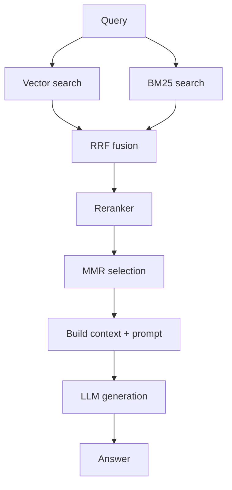
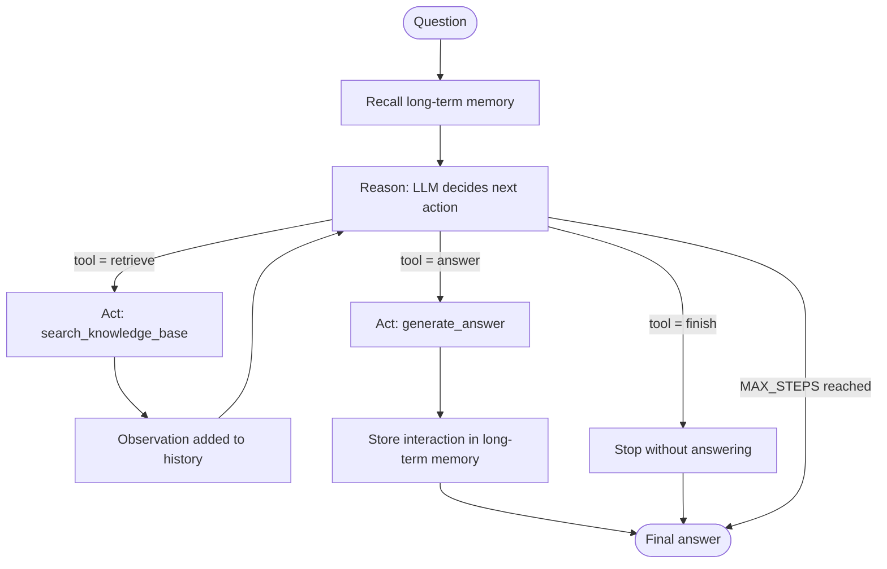

# WEEK7_AGENT — Agentic RAG: Workflow vs. Agent

## Purpose

This app has two ways of answering a question:

- **Workflow mode** (`/chat/stream`) — the existing fixed RAG pipeline in `app/services/rag_engine.py` (`execute_rag`).
- **Agent mode** (`/agent/run` in the eventual API, demonstrated here as `app/services/agent_loop.py`) — a ReAct agent that decides its own sequence of steps at runtime.

This doc captures the comparison between them, the concepts behind the agent, and where each concept lives in code.

---

## 1. Diagrams

### 1a. Fixed workflow (`execute_rag`)

The sequence is identical for every query — only which stages run depends on the chosen strategy, never on what any stage *found*.

No branch in this diagram depends on the *content* of a previous stage's output — only on the strategy chosen before the request started.

### 1b. Agent loop (`agent_loop.py`)

The same four boxes repeat; which edge gets taken each time is decided by the LLM at runtime.

The loop-back edge from `Observe` to `Reason` is the entire structural difference from the workflow diagram above — everything else (retrieval, generation) reuses the same underlying primitives.

---

## 2. Tool list

| Tool | Description (what the LLM is told) | Inputs | Implemented in |
|---|---|---|---|
| `retrieve` | Search the knowledge base for context relevant to a query | `{"query": "<search text>"}` | `agent_tools.py::search_knowledge_base`, calling `rag_engine.py::RagEngine.get_context` |
| `answer` | Produce the final answer using everything retrieved so far | `{}` | `agent_tools.py::generate_answer` |
| `finish` | Stop without producing a new answer | `{"message": "<optional note>"}` | handled inline in `agent_loop.py::act` |

Tool registry (single source of truth for descriptions fed into the system prompt): `agent_tools.py::TOOLS`.

---

## 3. Workflow vs. Agent — comparison

| Dimension | Workflow (`execute_rag`) | Agent (`agent_loop.py`) |
|---|---|---|
| Who decides the next step | Developer, in code, ahead of time | LLM, at runtime, one step at a time |
| LLM calls per request | 1 (final generation only) | Variable — 1 per reasoning step + 1 for the answer (up to `MAX_STEPS + 1`) |
| Can retry with a different search if the first one is weak? | No | Yes |
| Latency | Fast, single deterministic pass | Slower, scales with steps taken |
| Cost per request | Fixed | Variable, bounded by budgets (Section 5) |
| Testability | Deterministic — same input always takes the same path | Non-deterministic control flow — test behavior/outcomes, not one fixed trace |
| Best suited for | "Search once, generate once" is already good enough | Multi-hop lookup, self-correction, ambiguous queries |
| Exposed in this app as | Default mode, `/chat/stream` | Opt-in via the Agent toggle, `/agent/run` |

**Measured comparison:** `app/services/evaluation/agent_eval.py::run_agent_evaluation()` runs both paths over the same dataset and reports, per case and aggregated: retrieval hit rate, an answer-relevance heuristic, a faithfulness heuristic, latency, and (agent only) step count. See that module's docstring for the heuristics' definitions and honest limitations (no real LLM-judge is wired up anywhere in this codebase yet).

---

## 4. Concept index

Each concept below was built incrementally, in `app/services/agent_loop.py` unless noted, each one evolving the same file/loop rather than being a one-off demo.

| # | Concept | One-line idea | Where |
|---|---|---|---|
| 1 | Agent loop | Reason → Act → Observe → check stop, repeated | `agent_loop.py::run_agent_loop_skeleton` |
| 2 | ReAct | LLM produces Thought + Action together, as one parsed JSON object | `agent_loop.py::reason`, `_choose_action` |
| 3 | Tool design | Narrow, single-purpose, self-error-handling capabilities with a name/description/inputs | `agent_tools.py` |
| 4 | Tool calling | Dispatching the LLM's chosen tool name to the real function | `agent_loop.py::act` |
| 5 | Stop conditions & budgets | Step budget, per-step timeout, token budget, no-progress guard | `agent_loop.py::run_agent_loop_skeleton` (`MAX_STEPS`, `STEP_TIMEOUT_SECONDS`, `MAX_TOKEN_BUDGET`, `used_queries`) |
| 6 | Workflow vs Agent | Who decides the next step: code (workflow) or the model (agent) | Conceptual — Section 3 above |
| 7 | Agent vs workflow comparison | Concrete side-by-side using this app's own two code paths | Section 3 above |
| 8 | Short-term memory | `history`/`retrieved_chunks` — state scoped to one run | `agent_loop.py::run_agent_loop_skeleton` |
| 9 | Long-term memory concepts | State that survives across separate runs | Conceptual — implemented in Concept 11 |
| 10 | Summarisation | Compress older steps into a short summary once history grows | `agent_loop.py::summarize_history` |
| 11 | Vector memory | Embed past (query, answer) pairs; retrieve by similarity on later runs | `agent_memory.py::remember`, `recall` |
| 12 | mem0 | Managed memory library — extraction, conflict resolution, real vector index, per-user scoping | Conceptual — not adopted here, see Section 6 |
| 13 | LangChain / LangGraph | Mapping every concept above onto its framework equivalent | Section 6 |

---

## 5. Safety rails (Concept 5, detail)

| Guard | Constant | Failure mode it prevents |
|---|---|---|
| Step budget | `MAX_STEPS = 5` | Reasoning forever without reaching an answer |
| Per-step timeout | `STEP_TIMEOUT_SECONDS = 30` | One hung LLM/tool call blocking the whole run |
| Token budget | `MAX_TOKEN_BUDGET = 4000` | Unbounded spend as history grows every step |
| No-progress guard | `used_queries` set | Retrieving the identical query repeatedly without learning anything new |

Production config for this (max steps, temperature) lives in `app/core/config.py` (`AGENT_MAX_STEPS`, `AGENT_TEMPERATURE`) and is validated in the request schema (`AgentRunRequest.max_steps`, capped at 10).

---

## 6. Mapping to LangChain / LangGraph

| What we built | Equivalent |
|---|---|
| The `for` loop | LangGraph `StateGraph` — nodes + edges, a loop is an edge pointing back to an earlier node |
| `reason()` + `_choose_action()` | `create_react_agent()` |
| `TOOLS` registry | `@tool` decorator (auto-generates schema from function signature/docstring) |
| Dispatch in `act()` | `AgentExecutor` / LangGraph `ToolNode` |
| `MAX_STEPS`/`STEP_TIMEOUT_SECONDS`/`MAX_TOKEN_BUDGET` | `AgentExecutor(max_iterations=..., max_execution_time=...)`; LangGraph `recursion_limit` + conditional edges |
| Workflow vs. agent | Graph with only forward edges vs. a graph with a conditional edge that can loop back |
| `history` / `retrieved_chunks` | LangGraph typed `State` |
| Cross-run persistence (concept) | LangGraph `Store` |
| `summarize_history()` | `ConversationSummaryMemory` / `ConversationSummaryBufferMemory` |
| `agent_memory.py` | `VectorStoreRetrieverMemory` |
| mem0 | Ships official LangChain/LangGraph integrations — plugs into either directly |

**Why hand-build this instead of starting with LangGraph:** starting from `create_react_agent()` gives a working agent in minutes with no visibility into the JSON parsing, dispatch table, token budgeting, or similarity math underneath it. Building the primitives first means the framework's abstractions map onto something already understood, rather than being opaque magic — the difference matters the moment something breaks or needs customizing.
