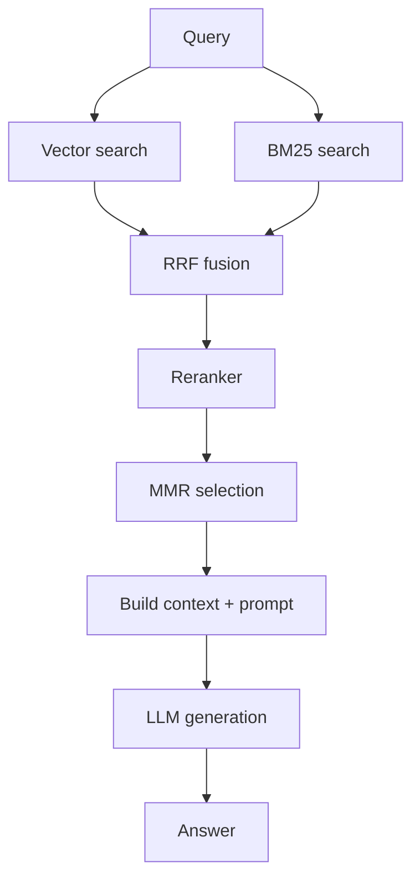
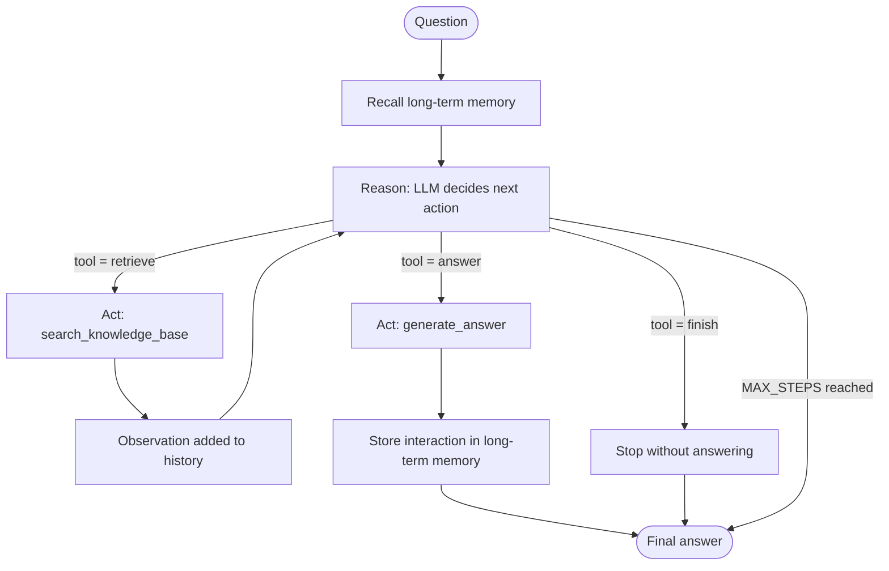

# WEEK7_AGENT — Agentic RAG: Workflow vs. Agent

## Purpose

This app has two ways of answering a question:

- **Workflow mode** (`/chat/stream`) — the existing fixed RAG pipeline in `app/services/rag_engine.py` (`execute_rag`).
- **Agent mode** (`/agent/run` in the eventual API, demonstrated here as `app/services/agent_loop.py`) — a ReAct agent that decides its own sequence of steps at runtime.

This doc captures the comparison between them, the concepts behind the agent, and where each concept lives in code.

---

## 1. Diagrams

### 1a. Fixed workflow (`execute_rag`)

The sequence is identical for every query — only which stages run depends on the chosen strategy, never on what any stage *found*.


```mermaid
flowchart TD
    Q[Query] --> V[Vector search]
    Q --> B[BM25 search]
    V --> R[RRF fusion]
    B --> R
    R --> RR[Reranker]
    RR --> M[MMR selection]
    M --> C[Build context + prompt]
    C --> L[LLM generation]
    L --> A[Answer]
```

No branch in this diagram depends on the *content* of a previous stage's output — only on the strategy chosen before the request started.

### 1b. Agent loop (`agent_loop.py`)

The same four boxes repeat; which edge gets taken each time is decided by the LLM at runtime.


```mermaid
flowchart TD
    Start([Question]) --> Recall[Recall long-term memory]
    Recall --> Reason[Reason: LLM decides next action]
    Reason -->|tool = retrieve| Retrieve[Act: search_knowledge_base]
    Retrieve --> Observe[Observation added to history]
    Observe --> Reason
    Reason -->|tool = answer| Answer[Act: generate_answer]
    Answer --> Remember[Store interaction in long-term memory]
    Reason -->|tool = finish| Finish[Stop without answering]
    Remember --> Done([Final answer])
    Finish --> Done
    Reason -->|MAX_STEPS reached| Done
```

The loop-back edge from `Observe` to `Reason` is the entire structural difference from the workflow diagram above — everything else (retrieval, generation) reuses the same underlying primitives.

---

## 2. Tool list

| Tool | Description (what the LLM is told) | Inputs | Implemented in |
|---|---|---|---|
| `retrieve` | Open-ended search of the knowledge base for context relevant to a query | `{"query": "<search text>"}` | `agent_tools.py::search_knowledge_base`, calling `rag_engine.py::RagEngine.get_context` |
| `check_deprecation` | Check whether ONE named endpoint/feature is deprecated in a SPECIFIC API version, and find its replacement | `{"endpoint_or_feature": "string", "api_version": "enum: 2022-11-28 \| 2026-03-10"}` | `agent_tools.py::check_deprecation` (Task Set E, Step 1) |
| `answer` | Produce the final answer using everything retrieved so far | `{}` | `agent_tools.py::generate_answer` |
| `finish` | Stop without producing a new answer | `{"message": "<optional note>"}` | handled inline in `agent_loop.py::act` |

Tool registry (single source of truth for descriptions fed into the system prompt): `agent_tools.py::TOOLS`.

**Strict, type-safe input schemas:** each tool has a matching Pydantic model (`RetrieveInputs`, `CheckDeprecationInputs`, `AnswerInputs`, `FinishInputs` in `agent_tools.py`). `agent_loop.py::act()` validates the LLM's JSON `inputs` against these *before* dispatch via `validate_tool_inputs()` — a missing/malformed field (e.g. an `api_version` that isn't a real enum value) becomes a clean, recoverable error observation the next reasoning step can see, instead of a raw exception from inside the tool.

**Bug found and fixed while cross-checking against a later spec revision:** `check_deprecation` was added to the `TOOLS` registry in Step 1, but the agent's own system prompt (`REACT_SYSTEM_PROMPT`) still hand-listed only `retrieve`/`answer`/`finish`, and `act()` never dispatched to it — the agent could never actually call its own third tool, even though the LLM's reasoning had no way to know that. The prompt's tool list is now *generated from* the `TOOLS` registry (`_build_tools_section()`) instead of duplicated as a second hand-maintained string, specifically so this class of drift can't happen again. All race numbers below are from the run **after** this fix.

---

## 3. Workflow vs. Agent — comparison

| Dimension | Workflow (`execute_rag`) | Agent (`agent_loop.py`) |
|---|---|---|
| Who decides the next step | Developer, in code, ahead of time | LLM, at runtime, one step at a time |
| LLM calls per request | 1 (final generation only) | Variable — 1 per reasoning step + 1 for the answer (up to `MAX_STEPS + 1`) |
| Can retry with a different search if the first one is weak? | No | Yes |
| Latency | Fast, single deterministic pass | Slower, scales with steps taken |
| Cost per request | Fixed | Variable, bounded by budgets (Section 5) |
| Testability | Deterministic — same input always takes the same path | Non-deterministic control flow — test behavior/outcomes, not one fixed trace |
| Best suited for | "Search once, generate once" is already good enough | Multi-hop lookup, self-correction, ambiguous queries |
| Exposed in this app as | Default mode, `/chat/stream` | Opt-in via the Agent toggle, `/agent/run` |

**Measured comparison:** `app/services/evaluation/agent_eval.py::run_agent_evaluation()` runs both paths over the same dataset and reports, per case and aggregated: retrieval hit rate, an answer-relevance heuristic, a faithfulness heuristic, latency, and (agent only) step count. See that module's docstring for the heuristics' definitions and honest limitations (no real LLM-judge is wired up anywhere in this codebase yet).

---

## 4. Concept index

Each concept below was built incrementally, in `app/services/agent_loop.py` unless noted, each one evolving the same file/loop rather than being a one-off demo.

| # | Concept | One-line idea | Where |
|---|---|---|---|
| 1 | Agent loop | Reason → Act → Observe → check stop, repeated | `agent_loop.py::run_agent_loop_skeleton` |
| 2 | ReAct | LLM produces Thought + Action together, as one parsed JSON object | `agent_loop.py::reason`, `_choose_action` |
| 3 | Tool design | Narrow, single-purpose, self-error-handling capabilities with a name/description/inputs | `agent_tools.py` |
| 4 | Tool calling | Dispatching the LLM's chosen tool name to the real function | `agent_loop.py::act` |
| 5 | Stop conditions & budgets | Step budget, per-step timeout, token budget, no-progress guard | `agent_loop.py::run_agent_loop_skeleton` (`MAX_STEPS`, `STEP_TIMEOUT_SECONDS`, `MAX_TOKEN_BUDGET`, `used_queries`) |
| 6 | Workflow vs Agent | Who decides the next step: code (workflow) or the model (agent) | Conceptual — Section 3 above |
| 7 | Agent vs workflow comparison | Concrete side-by-side using this app's own two code paths | Section 3 above |
| 8 | Short-term memory | `history`/`retrieved_chunks` — state scoped to one run | `agent_loop.py::run_agent_loop_skeleton` |
| 9 | Long-term memory concepts | State that survives across separate runs | Conceptual — implemented in Concept 11 |
| 10 | Summarisation | Compress older steps into a short summary once history grows | `agent_loop.py::summarize_history` |
| 11 | Vector memory | Embed past (query, answer) pairs; retrieve by similarity on later runs | `agent_memory.py::remember`, `recall` |
| 12 | mem0 | Managed memory library — extraction, conflict resolution, real vector index, per-user scoping | Conceptual — not adopted here, see Section 6 |
| 13 | LangChain / LangGraph | Mapping every concept above onto its framework equivalent | Section 6 |

---

## 5. Circuit breakers / safety rails (Concept 5, detail)

| Guard | Constant | Failure mode it prevents |
|---|---|---|
| Max iterations | `MAX_STEPS = 5` | Reasoning forever without reaching an answer |
| Max tokens | `MAX_TOKEN_BUDGET = 4000` | Unbounded spend as history grows every step |
| Max cost | `MAX_COST_USD = 0.01` | Same failure as tokens, expressed in the unit that actually matters (dollars) |
| Wall-clock | `MAX_WALL_CLOCK_SECONDS = 120` | The whole run taking too long even if step/token/cost budgets haven't tripped yet |
| Per-step timeout (extra, beyond the required 4) | `STEP_TIMEOUT_SECONDS = 30` | One hung LLM/tool call blocking the whole run |
| No-progress guard | `used_queries` set | Retrieving the identical query repeatedly without learning anything new |

All four required budgets are checked at the top of every loop iteration in `agent_loop.py::run_agent_loop_skeleton`, each logging a distinct `BUDGET HIT: ...` message and breaking cleanly (see Section 7.4 for a real captured log). Production config for iterations/temperature also lives in `app/core/config.py` (`AGENT_MAX_STEPS`, `AGENT_TEMPERATURE`) and is validated in the request schema (`AgentRunRequest.max_steps`, capped at 10) for the actual `/agent/run` API — separate from this task's demo constants.

---

## 6. Mapping to LangChain / LangGraph

| What we built | Equivalent |
|---|---|
| The `for` loop | LangGraph `StateGraph` — nodes + edges, a loop is an edge pointing back to an earlier node |
| `reason()` + `_choose_action()` | `create_react_agent()` |
| `TOOLS` registry | `@tool` decorator (auto-generates schema from function signature/docstring) |
| Dispatch in `act()` | `AgentExecutor` / LangGraph `ToolNode` |
| `MAX_STEPS`/`STEP_TIMEOUT_SECONDS`/`MAX_TOKEN_BUDGET` | `AgentExecutor(max_iterations=..., max_execution_time=...)`; LangGraph `recursion_limit` + conditional edges |
| Workflow vs. agent | Graph with only forward edges vs. a graph with a conditional edge that can loop back |
| `history` / `retrieved_chunks` | LangGraph typed `State` |
| Cross-run persistence (concept) | LangGraph `Store` |
| `summarize_history()` | `ConversationSummaryMemory` / `ConversationSummaryBufferMemory` |
| `agent_memory.py` | `VectorStoreRetrieverMemory` |
| mem0 | Ships official LangChain/LangGraph integrations — plugs into either directly |

**Why hand-build this instead of starting with LangGraph:** starting from `create_react_agent()` gives a working agent in minutes with no visibility into the JSON parsing, dispatch table, token budgeting, or similarity math underneath it. Building the primitives first means the framework's abstractions map onto something already understood, rather than being opaque magic — the difference matters the moment something breaks or needs customizing.

---

## 7. Task Set E — racing the agent against a fixed workflow

An extension of the above: settling "does this need to be an agent?" with four measured numbers instead of an opinion.

### 7.1 The third tool

`check_deprecation(endpoint_or_feature, api_version: ApiVersion)` — `ApiVersion` is a `str, Enum` with real values (`OLD = "2022-11-28"`, `CURRENT = "2026-03-10"`), matching the actual versions in the indexed docs (`old-version.md` / `current-version.md`). See Section 2's tool table and `DEPRECATION_EXPLAINED.md` for why this needed to be its own tool rather than a smarter `retrieve`.

**Description diff** (`agent_tools.py::TOOLS`), showing the overlap fix — both descriptions changed, not just the new one:

```diff
- "retrieve": "Search the knowledge base for context relevant to a query."
+ "retrieve": "Open-ended search of the knowledge base for context relevant to a query."
+ "check_deprecation": "Check whether ONE named endpoint or feature is deprecated in a
+   SPECIFIC API version, and find its replacement if so. Use this instead of retrieve
+   when the question is about deprecation/changelog status for a version, not general search."
```

### 7.2 The fixed workflow

`app/services/workflow_docs.py::run_fixed_workflow()` — same three tools, same model, same output contract as the agent, hard-coded order: `retrieve → check_deprecation(CURRENT) → answer`, no loop, no LLM deciding anything about control flow. Valid specifically because every question in this task's domain concerns migrating to the current API version — see that file's docstring and `DEPRECATION_EXPLAINED.md` Section 4 for why this exact assumption is what makes a fixed workflow possible here, and where it would break (a question needing the *old* version, or *both*).

### 7.3 The race

`app/services/evaluation/race_questions.py` — 10 real questions from `evals/developer_docs_cases.json` (5 straightforward single-lookup, 5 `requires_deprecation_check=True`, well above the rubric's "at least 3" floor). `app/services/evaluation/race_harness.py` runs both systems over all 10, scoring pass/fail by keyword presence (same ground-truth approach used throughout this codebase), and reports pass rate, **p50 and p99 latency**, **input/output tokens reported separately**, and cost both **per question** (all 10, failures included) and **per successful execution** (only the passes — the number that actually answers "what does it cost to get one right answer," since cost-per-question alone hides that a less reliable system pays more per real success).

**Token accounting fix applied before racing:** the agent sums input+output tokens from *every* reasoning lap (`agent_loop.py::reason` returns them per-call), not just the final answer — the exact undercounting mistake the rubric warns about.

**Results (`race.csv`, real run against the real LLM and knowledge base, after the tool-wiring fix in Section 2):**

| System | Pass rate | p50 latency | p99 latency | Input tokens | Output tokens | Cost/question | Cost/success |
|---|---|---|---|---|---|---|---|
| Agent | 0.8 (8/10) | 18,048 ms | 59,715 ms | 17,734 | 1,642 | $0.000969 | $0.001211 |
| Workflow | 0.9 (9/10) | 3,409 ms | 8,690 ms | 6,027 | 394 | $0.000321 | $0.000357 |

**This is the opposite of the buggy run's numbers** (which showed the agent narrowly ahead on pass rate). Once the agent could actually use `check_deprecation`, it took ~5.3x longer at p50 (~6.9x at p99), used ~3x the tokens, cost ~3x more per question and ~3.4x more per successful answer — *and* answered one fewer question correctly. Per-question detail (`race_details.csv`, now including the actual answer text for auditability):
- Both systems produced the **identical** correct answer for `gh-003` — the failure there is a keyword-strictness artifact in the test set (the answer never uses the literal string "migrat"), not a capability gap.
- The agent's one *extra* failure, `gh-006`, was not a retrieval or reasoning-quality miss — its final answer is literally `"I could not find a sufficient answer within the allotted budget."` It exhausted `MAX_STEPS=5` deliberating among four tools without ever calling `answer` — a genuine, newly-measured cost of a larger tool surface eating into a fixed iteration budget.

### 7.4 Budget enforcement — a real clean termination

All four required budgets are enforced in `agent_loop.py::run_agent_loop_skeleton`: max iterations (`MAX_STEPS`), max tokens (`MAX_TOKEN_BUDGET`), max cost (`MAX_COST_USD`), wall-clock (`MAX_WALL_CLOCK_SECONDS`). `scripts/demo_budget_termination.py` deliberately lowers the token budget to 50 (well below one real step's cost) and runs a real question — captured in full at `budget_termination_log.txt`. Excerpt:

```
Step 1: thought="To answer this question, I need to check the current documentation of the GitHub API to see if the has_downloads field is still included..." tool=retrieve -> {'chunk_count': 5, 'chunks': [...]}
BUDGET HIT: token budget (50) exhausted (183 used) before step 2. Terminating cleanly.

=== FINAL RESULT ===
answer: 'I could not find a sufficient answer within the allotted budget.'
steps completed: 1
total_latency_ms: 25334
input_tokens: 129, output_tokens: 54
```

One real step actually ran (real retrieval surfaced the real `has_downloads` deprecation content), then the loop terminated cleanly with a clear message and a graceful fallback answer — no crash, no hang, no silent spin.

### 7.5 Data-backed architecture verdict

After fixing check_deprecation's wiring, the corrected numbers are decisive: the workflow wins all four metrics — pass rate 0.9 vs 0.8, p50 3.4s vs 18.0s (p99 8.7s vs 59.7s), 6,421 vs 19,376 total tokens, $0.000357 vs $0.001211 per successful answer. The agent's extra failure, gh-006, wasn't a retrieval miss — it exhausted its 5-step budget deliberating among four tools without ever calling answer, a real cost of a larger tool surface eating a fixed iteration budget. Both systems produced the identical correct answer for gh-003, missing only the literal string "migrat" — a keyword-strictness artifact, not a capability gap. Honestly: none of these 10 questions forces an agent. All concern the current version (or both), which the workflow's hard-coded check always gets right; the agent's adaptability bought nothing here beyond added cost and one budget-exhaustion failure the workflow cannot even have.
